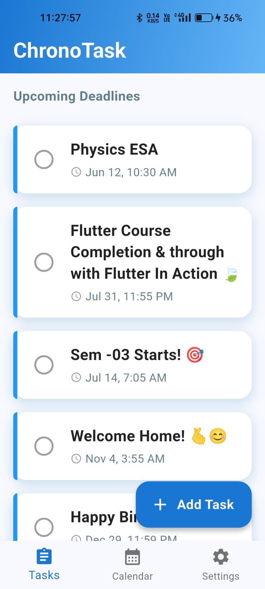
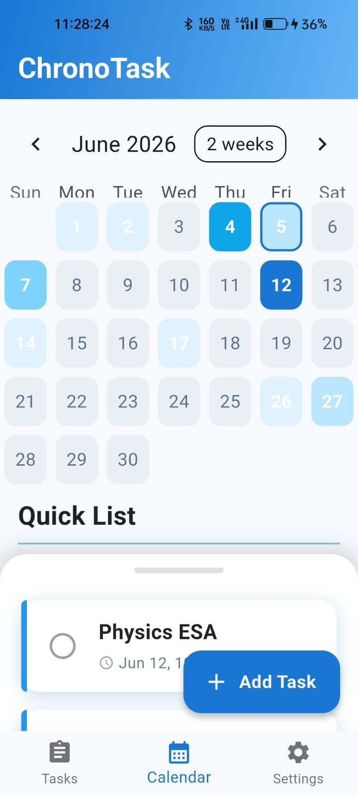
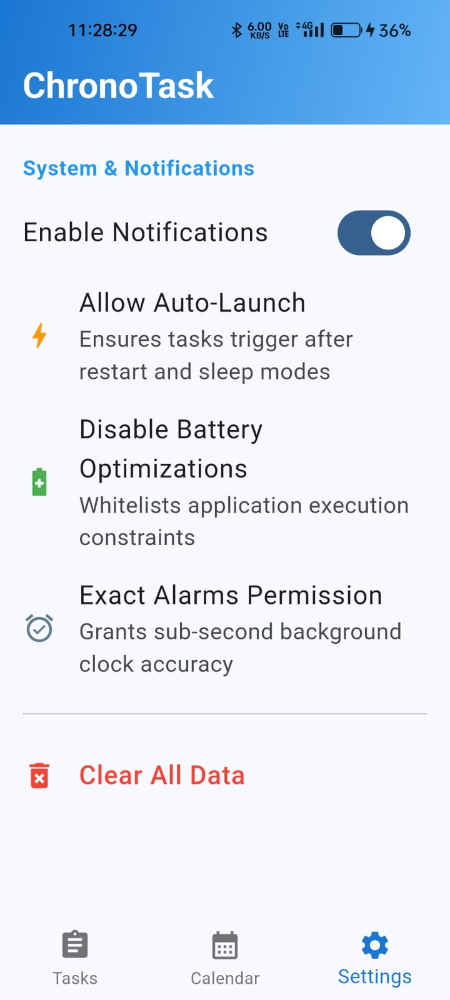

#  ChronoTask (Alva Indigo Ecosystem) — Public Showcase

Welcome to the public architecture and documentation repository for **ChronoTask**. 

> **Repository Status:** The core source code repository is kept private as a production-bound asset preparing for commercial deployment on the Google Play Store. This repository serves as an open-access blueprint of the system's technical design, engineering workflow, and alpha telemetry data.

---

##  User Interface & Visual Showcase
An enterprise-grade engine deserves an intuitive, modern workspace. Below are interface captures showcasing the design language, clean layout constraints, and responsive forms built for the ChronoTask dashboard.

  
  
  

---

##  System Architecture Overview
ChronoTask is an enterprise-grade task-scheduling engine designed to enforce high-precision alert execution under strict operating system constraints. 

* **Cross-Platform UI:** Built with Flutter for smooth, responsive, and platform-agnostic state management.
* **Native Kotlin Bridges:** Custom-engineered Android native channels looping directly into OEM system parameters to programmatically bypass aggressive battery optimization limits, Doze mode restrictions, and autostart constraints.

---

##  Background Engine & Scheduling Fidelity
To bypass aggressive Android OEM background execution limits, the native architecture handles deep sleep wake-locks cleanly. Below is a real-time, 10-second demonstration of the scheduling engine executing a high-priority notification with sub-second accuracy under system standby conditions.

  

---

##  Phase 01 Alpha Testing Results
To validate the scheduling engine's fidelity under real-world conditions, Phase 01 was deployed as an open alpha to a developer community. 

### Key Telemetry Data:
* **Hardware Coverage:** Tested across diverse OEM architectures including Xiaomi/Redmi/Poco, Realme, OnePlus, Samsung, and Vivo.
* **Alarm Precision:** **71%** of tracking deployments recorded perfect sub-second alarm execution stability straight out of system deep sleep / standby states.
* **Bridge Success:** The custom Kotlin autostart bridge achieved stable routing on 71% of test environments.

---

##  Engineering & Sprint Management
The project strictly implements industry-standard software management paradigms:
* **Feature Branch Isolation:** Development is containerized using organized Git branches.
* **Issue Tracking:** Real-world testing anomalies and UI edge cases are organized cleanly as tracked GitHub Issues (`bug`, `enhancement`) to maintain a professional, sprint-ready product backlog.

---
Developed by **Ankit Kumar Shaw** | *Lead Developer, Alva Indigo (Personal Project Initiative)*
